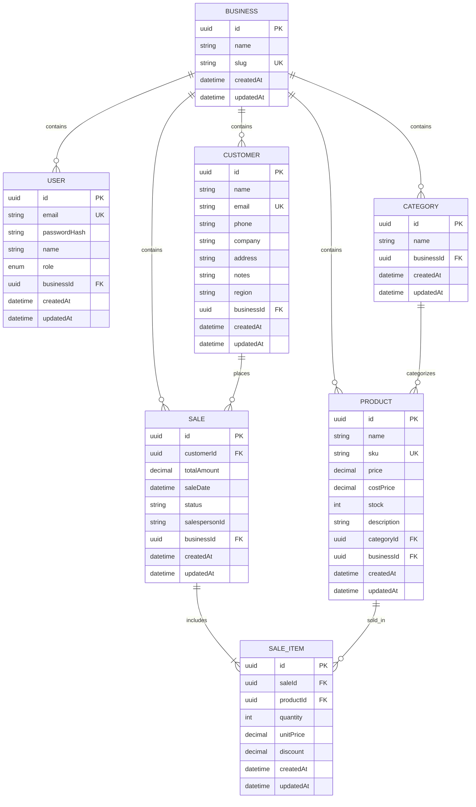

# AnalyticxIQ Database Documentation

This document describes the schema design, tables, relationships, indexes, and constraints of the PostgreSQL database backing the AnalyticxIQ platform, managed via Prisma ORM.

---

## 📐 Entity-Relationship Diagram (ERD)

---

## 🗄️ Tables and Fields Specification

### 1. `Business` (Tenant Entity)

Represents the tenant organization. All transactional data belongs to a business.

- `id`: `String (UUID)` | Primary Key.
- `name`: `String` | Legal name of the business.
- `slug`: `String` | URL-friendly unique identifier (Unique).
- `createdAt`: `DateTime` | Record generation timestamp.
- `updatedAt`: `DateTime` | Auto-update modification timestamp.

### 2. `User`

Accounts registered to access the system, associated with a tenant.

- `id`: `String (UUID)` | Primary Key.
- `email`: `String` | Login email address (Unique).
- `passwordHash`: `String` | Hashed password credentials.
- `name`: `String` | Full name of the user.
- `role`: `UserRole (Enum)` | Permissions level: `OWNER`, `ADMIN`, `MEMBER` (Default: `MEMBER`).
- `businessId`: `String (UUID)` | Reference to `Business(id)` (Foreign Key).
- _Foreign Key Constraints_: On Delete `CASCADE` (Deleting a business deletes all associated user profiles).

### 3. `Category`

Product categories.

- `id`: `String (UUID)` | Primary key.
- `name`: `String` | Name of the category.
- `businessId`: `String (UUID)` | Reference to `Business(id)` (Foreign Key).
- _Unique Constraints_: Unique combination of `[name, businessId]` (Different tenants can have same category name, but a single tenant cannot duplicate it).

### 4. `Product`

Inventory products catalog.

- `id`: `String (UUID)` | Primary key.
- `name`: `String` | Product label.
- `sku`: `String` | Stock Keeping Unit code (Unique within business).
- `price`: `Decimal(12, 2)` | Retail unit selling price.
- `costPrice`: `Decimal(12, 2) (Nullable)` | Cost purchase price of the item (used for profit analytics).
- `stock`: `Int` | Current inventory count (Default: `0`).
- `categoryId`: `String (UUID) (Nullable)` | Reference to `Category(id)` (Foreign Key, Set Null on Delete).
- `businessId`: `String (UUID)` | Reference to `Business(id)` (Foreign Key, Cascade on Delete).

### 5. `Customer`

Customer directories.

- `id`: `String (UUID)` | Primary key.
- `name`: `String` | Contact name.
- `email`: `String (Nullable)` | Email address (Unique within business).
- `region`: `String (Nullable)` | Geographic region for sales segmentation.
- `businessId`: `String (UUID)` | Reference to `Business(id)` (Foreign key, Cascade on Delete).

### 6. `Sale`

Sales transactions header.

- `id`: `String (UUID)` | Primary key.
- `customerId`: `String (UUID) (Nullable)` | Buyer. References `Customer(id)` (Set Null on Delete).
- `totalAmount`: `Decimal(12, 2)` | Net transaction value.
- `saleDate`: `DateTime` | Transaction completion date (Default: `now()`).
- `status`: `String` | State: `COMPLETED`, `CANCELLED` (Default: `COMPLETED`).
- `salespersonId`: `String (Nullable)` | Identifier of agent who processed the transaction.
- `businessId`: `String (UUID)` | Tenant reference.

### 7. `SaleItem`

Line items detailing individual products in a transaction.

- `id`: `String (UUID)` | Primary key.
- `saleId`: `String (UUID)` | Header reference. References `Sale(id)` (Cascade on Delete).
- `productId`: `String (UUID)` | Product reference. References `Product(id)` (Restrict on Delete - Products cannot be deleted if referenced in past sales).
- `quantity`: `Int` | Quantity purchased.
- `unitPrice`: `Decimal(12, 2)` | Discounted sale price per unit at the time of purchase.
- `discount`: `Decimal(5, 2)` | Applied discount percentage (Default: `0`).

---

## ⚡ Performance Indexes & Optimization

To maintain rapid retrieval speeds during high-volume aggregation queries on our BI dashboard, the following database indexes are applied:

1.  **Logical Isolation Index**: `@@index([businessId])` is applied on tables `User`, `Category`, `Product`, `Customer`, and `Sale` to speed up tenant-scoped filtering queries.
2.  **Date Filtering Index**: `@@index([saleDate])` and `@@index([businessId, saleDate])` are created on the `Sale` table to accelerate chronological date-range dashboard aggregates (Gross/Net revenues, monthly sales trends).
3.  **Customer Metrics Index**: `@@index([customerId])` on the `Sale` table optimizes customer purchase history query speeds.
4.  **Geographic Index**: `@@index([region])` on the `Customer` table speeds up regional revenue break-down metrics.
